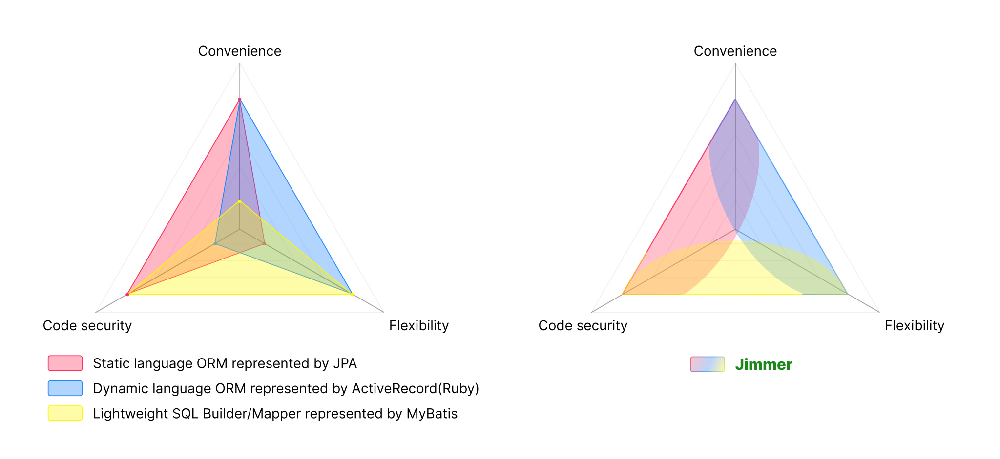
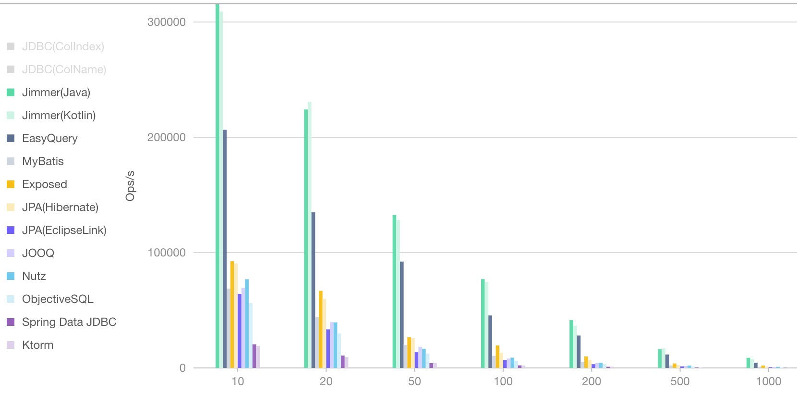

# The most advanced ORM of JVM, for both java & kotlin.

## Switch Langue 

English | [中文](./README_zh_CN.md)

## 1. Key features

-   Convenient query API, robust Java DSL, elegant Kotlin DSL
    -   Dynamic querying is designed for multi-table queries
    -   DSL supports mixing native SQL expressions to use non-standard database-specific capabilities
    -   Extends SQL capabilities, easily supporting advanced features that are costly to implement with native SQL
    -   Advanced SQL optimization capabilities
        -   Automatic removal of unnecessary table joins
        -   Automatic merging of logically equivalent table joins
        -   Automatic merging of logically equivalent implicit subqueries
        -   Paginated query can automatically generate and optimize count query
-   DTO language and corresponding compile-time code generator, making DTOs extremely cost-effective
    -   Output DTO, used as return for complex queries
    -   Input DTO, used as parameter for complex saves
    -   Specification DTO, used as parameter for complex queries
    -   The DTO supported by the ORM itself can be seamlessly integrated without introducing additional logic into business code
-   Query arbitrary graph structures
    -   No "N + 1" problem
    -   Objects at any level can be incomplete
    -   Can recursively query self-referencing properties
    -   Can return either entities directly or output DTOs
-   Save arbitrary graph structures
    -   Merge data using the database's native upsert capabilities
    -   Multiple objects at each level are handled using batch DML operations
    -   Automatically translates constraint violation exceptions
    -   Saved objects at any level can be incomplete
    -   Can save either entities directly or input DTOs
-   Powerful caching
    -   Multi-layer caching, technology for each cache layer can be freely chosen
    -   Not just object caching *(associations, computed values, multiple views)*
    -   Automatically maintains cache consistency
-   Rapid support for GraphQL
-   Client contracts based on document comments *(OpenAPI, TypeScript)*

## 2. Core Concept

The core concept of Jimmer is to read and write data structures of arbitrary shapes as a whole, rather than simply processing entity objects.

-   Jimmer entity objects **are not POJOs**, and can easily **express data structures of arbitrary shapes**.

-   Data structures of any shape can be processed as a whole for:

    -   **Reading**: Jimmer creates this infinitely flexible data structure and passes it to you
    -   **Writing**: You create this infinitely flexible data structure and pass it to Jimmer

Since Jimmer's design philosophy is to read and write data structures of arbitrary shapes rather than processing simple objects, how does it differ from technologies with similar capabilities?

<table>
<thead>
<tr>
<th>Comparison</th>
<th>Description</th>
</tr>
</thead>
<tbody>
<tr>
<td rowspan="3">GraphQL</td>
<td>GraphQL provides services to clients via HTTP; while in Jimmer, this is a ubiquitous framework API behavior that can be used directly without any services</td>
</tr>
<tr>
<td>GraphQL only focuses on querying data structures of arbitrary shapes; Jimmer not only does this but also focuses on how to write data structures of arbitrary shapes</td>
</tr>
<tr>
<td>GraphQL does not support recursive queries based on self-referencing properties, Jimmer does</td>
</tr>
<tr>
<td rowspan="5">JPA</td>
<td>In JPA, to control the shape of the data structure being saved, properties must be configured with insertable, updatable, or cascade <i>(for associated properties)</i>.
Regardless of the configuration, the saved data structure is fixed; Jimmer entities are not POJOs, their data structure shapes are ever-changing,
no prior planning and design is needed, any business scenario can construct the data structure it needs and save it directly</td>
</tr>
<tr>
<td>

For queries, JPA's `EntityGraphQL` is very complex; Jimmer provides two methods to achieve similar functionality:
controlling the format of returned entity objects, or generating DTOs through a cost-effective way and querying directly. Either way is much simpler than `EntityGraph`

</td>
</tr>
<tr>
<td>

In JPA, if you need to use a DTO object to query only part of the properties, the DTO must be a simple object without any associations. That is, it loses the most valuable capability of ORM, degrading from `ORM` to `OM`;
Jimmer's automatically generated DTOs support arbitrarily complex hierarchical relationships, **Jimmer is currently the only ORM that supports nested projections based on DTO**

</td>
</tr>
<tr>
<td>

In JPA, updating an object results in all updatable columns being modified. For simplicity, developers rarely use `update`, instead choosing to first query the complete object, modify some properties, and finally save the entire object; Jimmer can construct and directly save incomplete objects

</td>
</tr>
<tr>
<td>

JPA's `EntityGraphQL` does not support recursive queries based on self-referencing properties, Jimmer does

</td>
</tr>
<tr>
<td>MongoDB</td>
<td>
In MongoDB, each document structure is a data island. Although MongoDB's data structure is weakly typed, from a business perspective, which data islands exist and the internal hierarchical structure of each data island need to be designed and agreed upon in advance.
Once the design and agreement are completed, the format of the entire data view is fixed and must be processed from a fixed perspective;
In Jimmer, the shape of the data structure does not need to be designed in advance, any business scenario can freely plan a data structure format, and read and write the corresponding data structure as a whole.
</td>
</tr>
</tbody>
</table>

**Based on this core concept, Jimmer will bring you convenience that was previously unattainable in any technology stack, 
freeing you from dealing with tedious details and allowing you to focus on quickly implementing complex business logic.**

## 3. Comprehensive capabilities

## 4. Ultimate performance

## 5. Notes 

Since Jimmer is a compile-time framework, and considering that not all users are familiar with `apt` and `ksp`, it's necessary to mention an important detail. 

`Apt/Ksp` are standard technologies in the industry, and Java IDEs provide support for them.

-   In most cases, your modifications will include changes to Java or Kotlin code, such as changes in entity types or Web Controller*(Jimmer has its own implementations for OpenAPI and TypeScript generation)*. In this case, you only need to click the IDE's `Run` or `Debug` button once, without requiring a full compilation, to trigger all pre-compilation behaviors, the automatically generated source code and resource files will update automatically.

-   In rare cases, if you only modify DTO files, meaning there are no Java or Kotlin source code changes within the same project except for the DTO files, you have three options:

    -   Use the companion DTO plugin
    -   Perform a full compilation using maven or gradle commands, or the IDE's `Rebuild` button, which can achieve this purpose
    -   Delete the affected project's compilation output directory, then click the IDE's `Run` or `Debug` button

## 6. Links

-   Examples: https://github.com/babyfish-ct/jimmer-examples
-   Documentation: https://babyfish-ct.github.io/jimmer-doc/
-   Discord: https://discord.gg/PmgR5mpY3E
