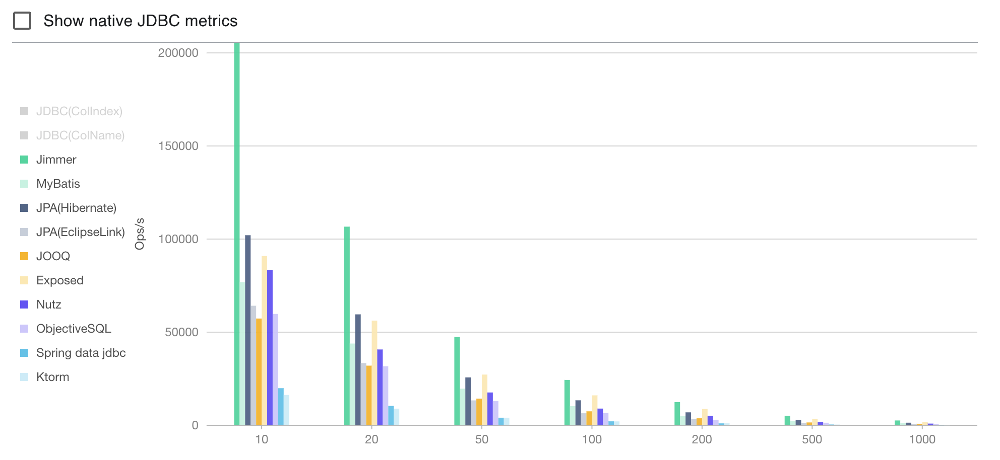

A revolutionary ORM framework for both java and kotlin.

- Immutable data model
- ORM based on immutable data model
- The ORM also provides a specialized API to speed up the development of Spring GraphQL

## 1，Video links

<table>
   <tr>
      <td>English</td>
      <td>https://www.youtube.com/watch?v=Rt5zNv0YR2E</td>
   </tr>
   <tr>
      <td rowspan="2">Chinese</td>
      <td>Global introduction: https://www.bilibili.com/video/BV1kd4y1A7K3</td>
   </tr>
   <tr>
      <td>Table Join Topci: https://www.bilibili.com/video/BV19t4y177PX</td>
   </tr>
<table>

## 2. Bechmark

- The abscissa represents the count of data objects queried from the database.
- The ordinate represents the operation count per second.

<kbd>
   
</kbd>

> 
> - If you want to view full benchmark report, click [here](https://babyfish-ct.github.io/jimmer-doc/docs/benchmark) please.
> 
> - If you want to run the benchmark, run the project under the sub directory [benchmark](./benchmark) please.

## 3. Documentation

The project provides complete documentation.

Please view [**documentation**](https://babyfish-ct.github.io/jimmer/)*(Both english & chinese)* to know everything.

## 4. Examples:

This framework provides three examples

1. Java Examples
   - [example/java/jimmer-core](example/java/jimmer-core): How to use immutable objects
   - [example/java/jimmer-sql](example/java/jimmer-sql): How to use ORM framework
   - [example/java/jimmer-sql-graphql](example/java/jimmer-sql-graphql): How to quickly develop [Spring GraphQL](https://spring.io/projects/spring-graphql) services based on jimmer.

2. Kotlin Examples
   - [example/kotlin/jimmer-core-kt](example/kotlin/jimmer-core-kt): How to use immutable objects
   - [example/kotlin/jimmer-sql-kt](example/kotlin/jimmer-sql-kt): How to use ORM framework
   - [example/kotlin/jimmer-sql-graphql-kt](example/kotlin/jimmer-sql-graphql-kt): How to quickly develop [Spring GraphQL](https://spring.io/projects/spring-graphql) services based on jimmer.

## 5. Discuss

|Language|Entry point|
|---|---|
|English|https://discord.com/channels/1016206034827743283/|
|Chinese||
